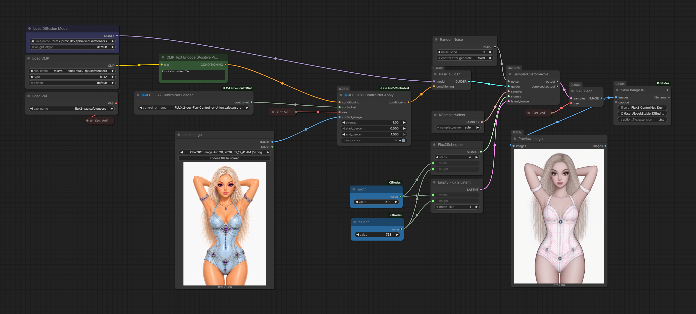
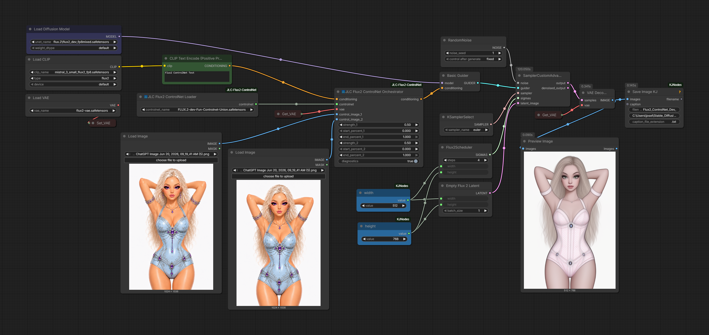

# JLC Flux2 ControlNet for ComfyUI

> A clean, ComfyUI-native FLUX.2 ControlNet implementation with non-recursive multi-ControlNet composition.


## Overview

**JLC Flux2 ControlNet** integrates compact FLUX.2 ControlNet side models into ComfyUI without replacing the native FLUX.2 transformer and without globally monkey-patching ComfyUI methods.

The project provides:

- A working single-ControlNet Apply path.
- A two-branch **JLC Flux2 ControlNet Orchestrator**.
- Flat, non-recursive multi-ControlNet composition.
- One shared ControlNet checkpoint/model across orchestrator branches.
- Independent control image, strength, and timestep range for each branch.
- Exact zero-strength bypass.
- ComfyUI-native model loading, offloading, hooks, and cleanup.
- DynamicVRAM-compatible lazy checkpoint materialization.

The current release is intentionally focused on **control-image conditioning for FLUX.2-dev**. Reference-latent and inpainting inputs are not yet implemented.

---

## See It Working: FLUX.2 ControlNet Toolchain

The included showcase workflows demonstrate both validated entry points into the toolchain.

The **ControlNet Apply** workflow shows the direct single-ControlNet path: one control image, one strength, and one timestep range attached to the conditioning. The **ControlNet Orchestrator** workflow demonstrates non-recursive composition: two independently configured control branches share one compact FLUX.2 ControlNet model, execute separately against the same sampler state, and have their residuals combined additively before injection.

Together, the workflows demonstrate:

- A shared compact FLUX.2 ControlNet model.
- Independent control images, strengths, and timestep ranges.
- Non-recursive two-branch residual composition through the Orchestrator.
- Native FLUX.2 sampling through ComfyUI.
- DynamicVRAM-compatible model loading and offloading.

### JLC Flux2 ControlNet Apply



[Download PNG workflow](assets/workflows/jlc_Flux2_ControlNet_Dev_001.png) ·
[Download JSON workflow](assets/workflows/jlc_Flux2_ControlNet_Dev_001.json)

### JLC Flux2 ControlNet Orchestrator



[Download PNG workflow](assets/workflows/jlc_Flux2_ControlNet_Dev_002.png) ·
[Download JSON workflow](assets/workflows/jlc_Flux2_ControlNet_Dev_002.json)

Each PNG contains an embedded ComfyUI workflow and can be dragged directly into ComfyUI. The corresponding JSON file is provided for standard workflow loading.

Additional example workflows will be included under:

```text
assets/workflows/
```

---

## Current Capability Freeze

The present milestone includes:

| Capability | Status |
|---|---:|
| Single FLUX.2 ControlNet Apply | Working |
| Two-branch ControlNet Orchestrator | Working |
| Shared ControlNet checkpoint/model | Working |
| Independent branch images | Working |
| Independent branch strengths | Working |
| Independent branch start/end ranges | Working |
| Flat non-recursive composition | Working |
| Exact strength-zero bypass | Working |
| DynamicVRAM lazy loading | Working |
| Reference latents | Not implemented |
| Inpaint image / mask conditioning | Not implemented |
| Arbitrary dynamic branch count | Not implemented |

This capability set is the project's first stable public freeze point.

---

## Why This Project Exists

Early FLUX.2 ControlNet integrations demonstrated that the published compact ControlNet checkpoint could work, but commonly depended on one of two approaches:

1. Globally replacing or monkey-patching the native FLUX.2 forward path.
2. Running a separate combined transformer implementation outside ComfyUI's normal model lifecycle.

This project follows a different design:

- Keep ComfyUI's native FLUX.2 model intact.
- Load the compact ControlNet side branch as a real additional model.
- Execute the side branch through ComfyUI's model-management lifecycle.
- Inject its residuals through a per-invocation transformer wrapper.
- Compose multiple controls as independent branches rather than a recursive chain.

The result is a narrow, inspectable integration that cooperates with current ComfyUI loading and offloading behavior.

---

## Nodes

### JLC Flux2 ControlNet Loader

Loads a compatible compact FLUX.2 ControlNet checkpoint from:

```text
ComfyUI/models/controlnet/
```

The loader uses a deferred checkpoint handle so that the large text encoder can load before the ControlNet checkpoint is materialized for sampling. The resulting side model is managed through ComfyUI's `CoreModelPatcher` lifecycle.

### JLC Flux2 ControlNet Apply

Applies one control image to conditioning with:

- `strength`
- `start_percent`
- `end_percent`
- optional diagnostics

The VAE is required because the control image is encoded into FLUX.2 latent space before side-branch execution.

### JLC Flux2 ControlNet Orchestrator

Applies two independent control branches while sharing one loaded ControlNet model.

Each branch has its own:

- control image
- strength
- start percentage
- end percentage

The orchestrator does **not** create a recursive `previous_controlnet` execution chain. Both branches are evaluated independently, and their residuals are merged before injection into the native FLUX.2 blocks.

---

## Architecture

### Compact side model

The validated checkpoint contains only the compact control branch:

- 76 BF16 tensors
- 4,116,248,576 parameters
- approximately 7.67 GiB of tensor data
- one `control_img_in` projection
- four control transformer blocks

It does not contain another complete FLUX.2 base transformer.

### Native ComfyUI integration

The implementation uses:

- `comfy.controlnet.ControlBase`
- `comfy.model_patcher.CoreModelPatcher`
- `TransformerOptionsHook`
- a keyed `DIFFUSION_MODEL` wrapper
- native `patches_replace` composition

No ComfyUI class or FLUX.2 method is replaced globally.

### Residual path

For each active control branch:

1. The control image is resized and encoded with the connected FLUX.2 VAE.
2. A 260-channel control context is built from:
   - 128 control-latent channels
   - 4 zero mask channels
   - 128 zero masked-image-latent channels
3. The compact four-block side model executes once per denoising forward.
4. Four residual tensors are produced.
5. Residuals are injected after native FLUX.2 double blocks:

```text
0, 2, 4, 6
```

Strength is applied at injection time rather than by altering the side-model weights.

### Non-recursive composition

For multiple controls, the orchestrator evaluates each branch independently against the same native block state and combines the resulting residuals additively.

Conceptually:

```text
combined_residual = strength_A * residual_A
                  + strength_B * residual_B
```

The controls do not feed into one another.

As a composition check, two identical branches at strengths `0.5 + 0.5` produced a pixel-exact match to one branch at strength `1.0` in the validation workflow.

---

## Requirements

- A current ComfyUI installation with native FLUX.2 support.
- Python 3.10 or newer.
- PyTorch with a supported accelerator backend.
- A FLUX.2-dev diffusion model.
- A compatible FLUX.2 text encoder.
- A compatible FLUX.2 VAE.
- A supported compact FLUX.2 ControlNet checkpoint.

Validated checkpoint filename:

```text
FLUX.2-dev-Fun-Controlnet-Union.safetensors
```

Model weights are **not** included in this repository. Obtain all models from their original distribution sources and comply with their respective licenses.

---

## Installation

Clone or copy the repository into ComfyUI's `custom_nodes` directory:

```text
ComfyUI/custom_nodes/JLC-Flux2-ControlNet/
```

Place the ControlNet checkpoint in:

```text
ComfyUI/models/controlnet/FLUX.2-dev-Fun-Controlnet-Union.safetensors
```

Restart ComfyUI. The nodes should appear under the JLC Flux2 ControlNet category.

No separate Python package installation is currently required beyond the dependencies already used by a compatible ComfyUI installation.

---

## Quick Start: Single Control

1. Load a FLUX.2 diffusion model, text encoder, and VAE.
2. Add **JLC Flux2 ControlNet Loader** and select the compact checkpoint.
3. Add **JLC Flux2 ControlNet Apply**.
4. Connect:
   - positive conditioning
   - ControlNet output
   - FLUX.2 VAE
   - control image
5. Start with:

```text
strength:      0.75
start_percent: 0.0
end_percent:   1.0
```

6. Send the resulting conditioning to the guider used by the FLUX.2 sampling workflow.
7. Use FLUX.2-native latent and scheduling nodes, such as `EmptyFlux2LatentImage` and `Flux2Scheduler`.

The project does not perform pose, edge, depth, or other preprocessing itself. Connect the output of the desired image preprocessor to the control-image input.

---

## Quick Start: Two-Control Orchestrator

1. Load the ControlNet checkpoint once.
2. Connect the loader output to **JLC Flux2 ControlNet Orchestrator**.
3. Connect one VAE and up to two control images.
4. Configure each branch independently.
5. Send the orchestrator's conditioning output to the FLUX.2 guider.

A branch with strength `0` is an exact bypass and should not execute the side model for that branch.

Because both branches share one ControlNet model, the checkpoint is not duplicated merely because two controls are active.

---

## Memory Behavior

The compact ControlNet checkpoint is still a large model at approximately 7.67 GiB in BF16. This project does not reduce the checkpoint's parameter count.

Instead, it integrates the model with ComfyUI's loading system so that:

- the checkpoint can be materialized lazily;
- the side model can participate in DynamicVRAM staging and offloading;
- multiple orchestrator branches share one model owner;
- zero-strength controls do not needlessly execute the side branch;
- cleanup remains part of the normal ControlNet lifecycle.

A 16 GB RTX 4090 Laptop GPU was sufficient for the validated development workflows when used with ComfyUI's dynamic model loading. Larger resolutions and heavier model combinations may require substantial offloading and will be slower.

---

## Validation

The initial release was validated with:

- coherent single-ControlNet image generation;
- visible pose and structure transfer from the control image;
- independent strength changes;
- independent timestep ranges;
- exact zero-strength bypass;
- two active non-recursive branches;
- one shared compact side model;
- pixel-exact `0.5 + 0.5 = 1.0` composition testing;
- successful DynamicVRAM partial staging;
- repeated sampling without global FLUX.2 monkey-patching.

Development baseline:

```text
ComfyUI commit: 2a610155821d670a2d8047e654e5fce96b790eb5
Frontend:       1.45.19
Python:         3.10.11
PyTorch:        2.9.1+cu130
GPU:            RTX 4090 Laptop, 16 GB VRAM
```

Compatibility with later ComfyUI versions should be tested as ComfyUI's FLUX.2 internals evolve.

---

## Diagnostics

When diagnostics are enabled, the console can report:

- wrapper activation;
- control latent and context shapes;
- compact side-model execution;
- residual tensor shapes and norms;
- target injection blocks;
- branch strengths;
- non-recursive composition behavior;
- lazy checkpoint materialization.

Diagnostics are intended for validation and troubleshooting. They can be disabled for routine use.

---

## Current Limitations

- FLUX.2 control-image mode only.
- Designed and validated around the FLUX.2-dev compact Union checkpoint listed above.
- No reference-latent conditioning.
- No inpainting image or mask path.
- Orchestrator currently exposes two control branches rather than a dynamic arbitrary-count interface.
- Single-GPU execution is the validated target.
- This is an experimental integration and not an official Black Forest Labs or ComfyUI project.

---

## Project Structure

```text
JLC-Flux2-ControlNet/
├── jlc_flux2_controlnet/
│   ├── constants.py
│   ├── composition.py
│   ├── control.py
│   ├── hooks.py
│   ├── loader.py
│   └── model.py
├── nodes/
│   ├── jlc_flux2_controlnet_apply_node.py
│   ├── jlc_flux2_controlnet_loader_node.py
│   └── jlc_flux2_controlnet_orchestrator_node.py
├── workflows/
├── THIRD_PARTY_NOTES.md
└── __init__.py
```

---

## Design Principles

This repository intentionally favors:

- native ComfyUI lifecycle integration;
- local, per-invocation hooks;
- explicit model ownership;
- flat composition;
- deterministic and inspectable behavior;
- narrow feature claims supported by validation;
- no hidden mutation of ComfyUI's global FLUX.2 implementation.

---

## Acknowledgments

This work builds on and was informed by:

- ComfyUI and its native FLUX.2 implementation, model patcher, hooks, and ControlNet lifecycle;
- Black Forest Labs' FLUX.2 model family;
- the public Flux2Fun implementation;
- the public VideoX-Fun FLUX.2 ControlNet implementation;
- the authors and distributors of the compact FLUX.2 ControlNet checkpoint.

Those projects served as important references for checkpoint structure and expected ControlNet mathematics. JLC Flux2 ControlNet implements its own ComfyUI-native integration strategy.

Developed by **J. L. Córdova**, with research and implementation assistance from **OpenAI ChatGPT**.

See [`THIRD_PARTY_NOTES.md`](THIRD_PARTY_NOTES.md) for additional attribution and licensing notes.

---

## License

The source code in this repository is released under the **MIT License**. See [`LICENSE`](LICENSE).

Model weights are not included and remain subject to the licenses and terms of their original publishers.

---

## Status

The working single-ControlNet path and the two-branch non-recursive Orchestrator are frozen as the first public milestone. Further development should preserve these validated paths while adding new capabilities incrementally.
