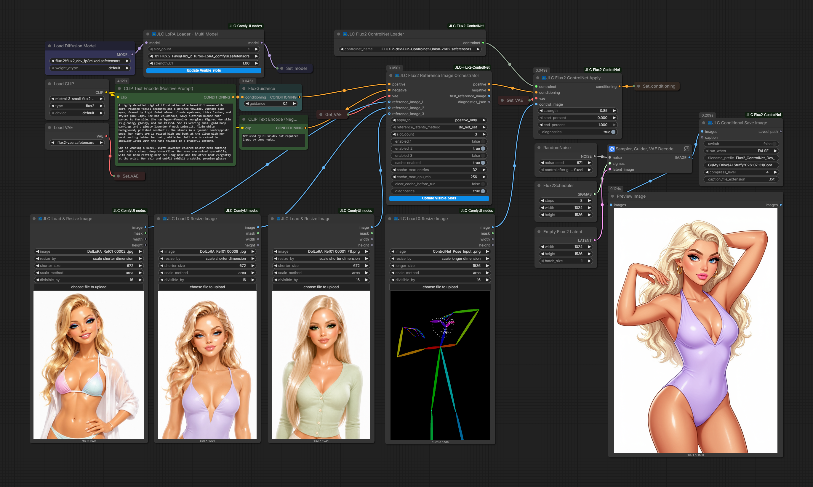
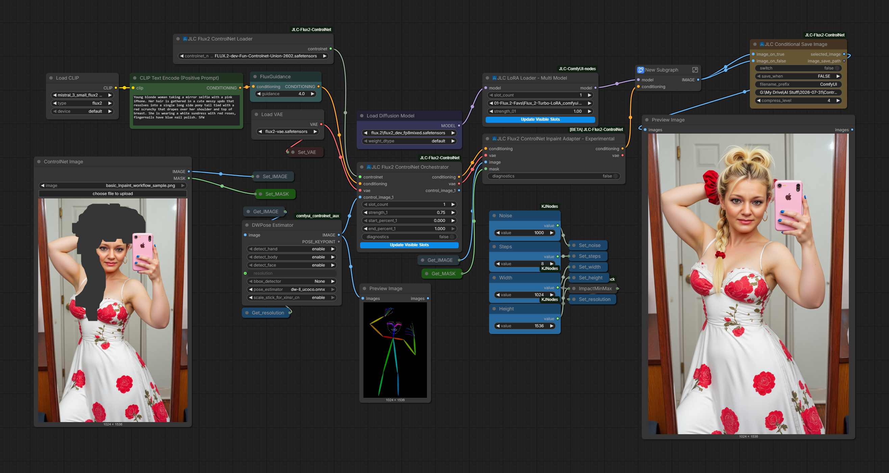

<p align="center">
  
</p>

<h1 align="center">JLC Flux2 ControlNet for ComfyUI</h1>

<p align="center">
  ComfyUI-native FLUX.2 ControlNet with flat multi-ControlNet composition,<br>
  multi-reference conditioning, optional latent caching, and experimental in/out-paint support.
</p>

<p align="center">
  
  
  
  
  
</p>

---

## Overview

**JLC Flux2 ControlNet** integrates the compact FLUX.2-dev Fun ControlNet Union side model into ComfyUI while preserving ComfyUI's native FLUX.2 transformer, sampler, hooks, model loading, offloading, and cleanup paths.

The project provides a conventional single-ControlNet Apply path and a preferred **flat, non-recursive Orchestrator** for combining up to four independently configured ControlNet branches through one shared loaded side model. It also adds multi-reference conditioning, reusable CPU latent caches, cache-preparation utilities, and an experimental mask-aware in/out-paint path with optional precomputed inpaint-context caching.

> **Extend FLUX.2 without replacing it.**

## Highlights

- **ComfyUI-native integration** with no global replacement of the FLUX.2 model or sampler
- **Single-ControlNet Apply** and positive/negative Advanced Apply interfaces
- **One-to-four-branch ControlNet Orchestrator** with independent images, strengths, and timestep ranges
- **Flat non-recursive composition** with shared side-model weights
- **Up to ten reference images** with per-slot enable controls and native reference-method metadata
- **Bounded process-local CPU caches** for ControlNet hint latents and reference-image latents
- **Dedicated ControlNet, reference-image, and experimental inpaint-context cache nodes** for mutually exclusive prep/inference workflows
- **Dynamic slot interfaces** that expose only the configured ControlNet or reference-image slots
- **Conditional Save Image** utility designed for branch-gated cache workflows
- **Experimental In/Out-Paint Adapter** for mask-aware FLUX.2-dev Fun ControlNet Union workflows
- **Experimental Inpaint Context Cache** that precomputes the hard keep-mask context and masked-source Flux2 latent before sampling

## Project Principles

- **Native ComfyUI first** — use ComfyUI's lifecycle instead of replacing it.
- **Local execution hooks** — no global FLUX.2 monkey-patching.
- **Explicit ownership** — configured branches share model weights without duplicating the side model.
- **Flat composition** — Orchestrator branches are evaluated independently rather than recursively chained.
- **Narrow claims** — stable and experimental capabilities are identified separately.

---

## Included Workflow

The repository includes Release 1.0.0 reference-image and multi-ControlNet and Inpaint Adapter workflows. The PNG files contain embedded ComfyUI workflow data and can be dragged directly into ComfyUI. The JSON files are provided for standard workflow loading:

[](assets/workflows/Release_1.0.0/Flux2_ControlNet_RefImages_BASIC_01.png)

[Download the PNG workflow](assets/workflows/Release_1.0.0/Flux2_ControlNet_RefImages_BASIC_01.png) ·
[Download the JSON workflow](assets/workflows/Release_1.0.0/Flux2_ControlNet_RefImages_BASIC_01.json)

[](assets/workflows/Release_1.0.0/jlc_Flux2_ControlNet_with_Inpainting_workflow.png)

[Download the PNG workflow](assets/workflows/Release_1.0.0/jlc_Flux2_ControlNet_with_Inpainting_workflow.png) ·
[Download the JSON workflow](assets/workflows/Release_1.0.0/jlc_Flux2_ControlNet_with_Inpainting_workflow.json)

[](assets/workflows/Release_1.0.0/Flux2_ControlNet_RefImages_Inpaint_workflow.png)

[Download the PNG workflow](assets/workflows/Release_1.0.0/Flux2_ControlNet_RefImages_Inpaint_workflow.png) ·
[Download the JSON workflow](assets/workflows/Release_1.0.0/Flux2_ControlNet_RefImages_Inpaint_workflow.json)

> [!NOTE]
> The package does not include pose, depth, edge, luminance, color, or other image preprocessors. Example workflows may use ComfyUI preprocessors and companion custom nodes that must be installed separately. Users may also choose auxiliary preprocessing and workflow-utility nodes from the companion JLC ComfyUI Nodes package: https://github.com/Damkohler/jlc-comfyui-nodes.git. That package is optional and is not required for the core JLC Flux2 ControlNet nodes to function.

---

## Installation

Clone the repository into ComfyUI's `custom_nodes` directory:

```bash
cd ComfyUI/custom_nodes
git clone https://github.com/Damkohler/JLC-Flux2-ControlNet.git
```

Or copy the repository manually to:

```text
ComfyUI/custom_nodes/JLC-Flux2-ControlNet/
```

Place a compatible compact FLUX.2-dev Fun ControlNet Union checkpoint in:

```text
ComfyUI/models/controlnet/
```

Then restart ComfyUI.

### Requirements

- A current ComfyUI installation with native FLUX.2 support
- Python 3.10 or newer
- A compatible FLUX.2-dev diffusion model, text encoder, and VAE
- A compatible compact `FLUX.2-dev-Fun-Controlnet-Union` checkpoint
- Sufficient system RAM, VRAM, or model-offloading capacity for FLUX.2-dev and the ControlNet side model

Model weights are not included in this repository. Obtain all model files from their original distribution sources and follow their respective licenses and terms.

---

## Quick Start

1. Load a FLUX.2-dev diffusion model, compatible text encoder, and FLUX.2 VAE.
2. Add **JLC Flux2 ControlNet Loader** and select the compact ControlNet checkpoint.
3. Prepare a control image with the appropriate external preprocessor.
4. Add **JLC Flux2 ControlNet Orchestrator** and connect the loader, conditioning, VAE, and control image to slot 1.
5. Set `slot_count` to the number of ControlNet branches in use. Slot 1 is required; slots 2–4 are optional.
6. Configure each active branch's strength and start/end percentages.
7. Connect the resulting conditioning to the FLUX.2 guider and sampler.

Use **JLC Flux2 ControlNet Apply** for a conventional single-ControlNet path. Use an **Advanced** variant when separate positive and negative conditioning inputs are required.

### Add reference images

Place **JLC Flux2 Reference Image Orchestrator** before the ControlNet Apply or Orchestrator node. It can attach one shared reference-latent sequence to positive conditioning, negative conditioning, or both, with up to ten independently enabled reference-image slots.

### Reuse encoded latents

The runtime can reuse unchanged ControlNet hint latents, reference-image latents, and experimental inpaint context from bounded CPU caches during the same ComfyUI server session. For an explicit prewarm branch, use:

- **JLC Flux2 ControlNet Latents Cache** for up to four active control images
- **JLC Flux2 Reference Latents Cache** for up to ten active reference images
- **JLC Flux2 Inpaint Context Cache** for the static packed keep-mask context and VAE-encoded masked-source latent
- **JLC Conditional Save Image** as the lazy branch selector and output companion

Place the three cache-preparation nodes in the same mutually exclusive setup branch. The Inpaint Context Cache node's `LATENT` input must come from the same **Empty Flux2 Latent** node used by the sampler, not from the sampler output.

Caches are process-local and are cleared when the ComfyUI process ends or when explicitly reset. The ordinary inline preparation path remains available whenever no matching cache entry exists.

---

## Experimental In/Out-Paint Adapter

JLC Flux2 ControlNet includes an **Experimental In/Out-Paint Adapter** for the FLUX.2-dev Fun ControlNet Union mask-aware path.

The adapter is placed after **JLC Flux2 ControlNet Apply** or **JLC Flux2 ControlNet Orchestrator** and preserves the validated clean/empty Flux2 sampler latent workflow.

Mask convention:

- **White** = editable or regenerate
- **Black** = preserve or retain

Release 1.0.0 uses a hard binary mask thresholded at `0.5`. The source image and mask must already match the active sampling canvas exactly; mismatched dimensions are rejected with a clear error rather than resized silently.

The first active ControlNet branch carries the shared inpaint context. Additional ControlNet branches remain ordinary full-frame controls and are not spatially mask-gated. Dense controls such as luminance, depth, or color may therefore preserve or imprint source structure inside editable regions. OpenPose/DWPose is the recommended host control, with auxiliary controls kept at conservative strengths and short activation ranges.

> [!WARNING]
> The adapter remains **Experimental**. Seed-variable mask-edge or contour artifacts may still occur, and dense or high-strength auxiliary branches can compete with prompt, reference-image, or inpaint guidance. Experimental mask expansion and feathering controls were removed after validation produced visible mask-shaped gray artifacts.

## Experimental Inpaint Context Cache

The **JLC Flux2 Inpaint Context Cache** precomputes and stores the static inpaint context before sampling:

- packed four-channel hard keep-mask context
- VAE-encoded masked-source Flux2 latent

Cached tensors are detached, contiguous CPU tensors held in a bounded process-local cache. During inference, the adapter reuses matching prepared context and avoids performing the masked-source VAE encode inside the first sampling step.

The cache-preparation node should be placed in the same mutually exclusive setup branch as the **JLC Flux2 ControlNet Latents Cache** and **JLC Flux2 Reference Latents Cache** nodes. Its `LATENT` input must come from the same **Empty Flux2 Latent** node used by the sampler, not from the sampler output.

The normal inline preparation path remains available as a fallback when no matching cache entry exists.

Validated Release 1.0.0 configurations include:

- 1024 × 1536 target resolution
- three reduced-size reference images
- OpenPose/DWPose at full range
- optional conservative luminance guidance
- warmed ControlNet, reference-image, and inpaint-context caches

A third dense auxiliary ControlNet may remain computationally fast while still introducing visible conditioning-conflict artifacts. Both the adapter and the Inpaint Context Cache remain explicitly **Experimental** in Release 1.0.0.

---

## Node Overview

| Node | Status | Purpose |
|---|---|---|
| **JLC Flux2 ControlNet Loader** | Stable | Loads the compatible compact side model as a reusable JLC ControlNet object. |
| **JLC Flux2 ControlNet Apply** | Stable | Attaches one configured ControlNet branch to one conditioning stream. |
| **JLC Flux2 ControlNet Apply Advanced** | Stable | Attaches one shared configuration to positive and negative conditioning. |
| **JLC Flux2 ControlNet Orchestrator** | Stable | Builds a flat one-to-four-branch composition for one conditioning stream. |
| **JLC Flux2 ControlNet Orchestrator Advanced** | Stable | Shares one flat composition across positive and negative conditioning. |
| **JLC Flux2 Reference Image Orchestrator** | Stable | Encodes and attaches up to ten reference images with optional CPU caching. |
| **JLC Flux2 ControlNet Latents Cache** | Stable utility | Prewarms reusable ControlNet hint latents for up to four active images. |
| **JLC Flux2 Reference Latents Cache** | Stable utility | Prewarms reusable reference-image latents for up to ten active images. |
| **JLC Flux2 Inpaint Context Cache** | **Experimental utility** | Precomputes the packed hard keep-mask context and masked-source Flux2 latent for reuse by the experimental adapter. |
| **JLC Conditional Save Image** | Stable utility | Selects a lazy true/false image branch and conditionally saves its result. |
| **JLC Flux2 ControlNet Inpaint Adapter - Experimental** | **Experimental** | Adds one shared mask-aware in/out-paint context to the first active branch of an existing JLC control path. |
| **JLC Flux2 ControlNet Inpaint Adapter Advanced - Experimental** | **Experimental** | Applies the same experimental shared mask-aware context to positive and negative streams. |

---

## Documentation

The detailed Release 1.0.0 documentation is organized from practical usage toward implementation detail.

### Getting Started

- [Installation](docs/getting-started/installation.md)
- [Quick Start](docs/getting-started/quick-start.md)
- [Included Workflows](docs/getting-started/workflows.md)

### Feature Guides

- [Multi-ControlNet Composition](docs/guides/multi-controlnet-composition.md)
- [Reference Images](docs/guides/reference-images.md)
- [Latent Caching and Prewarming](docs/guides/latent-caching.md)
- [Experimental Inpaint Context Cache](docs/guides/inpaint-context-cache-experimental.md)
- [Experimental In/Out-Painting](docs/guides/in-out-painting-experimental.md)
- [Performance and Memory](docs/guides/performance-and-memory.md)

### Node Reference

- [ControlNet Loader and Apply Nodes](docs/nodes/loader-and-apply.md)
- [ControlNet Orchestrators](docs/nodes/controlnet-orchestrators.md)
- [Reference Image Orchestrator](docs/nodes/reference-image-orchestrator.md)
- [ControlNet and Reference Latent Cache Nodes](docs/nodes/cache-preparation.md)
- [Experimental Inpaint Context Cache](docs/nodes/inpaint-context-cache-experimental.md)
- [Conditional Save Image](docs/nodes/conditional-save-image.md)
- [Experimental In/Out-Paint Adapter](docs/nodes/in-out-paint-adapter-experimental.md)

### Architecture and Development

- [Architecture](docs/developer/architecture.md)
- [Repository Layout](docs/developer/repository-layout.md)
- [Validation and Design History](docs/developer/validation-and-design-history.md)

### Historical Material

- [Early technical concept paper](docs/JLC_Flux2_ControlNet_Technical_Paper_preview.pdf) — retained as a historical white-paper preview; some concepts are incomplete or superseded by the current implementation and documentation.

---

## Current Scope and Limitations

- The validated target is the compact FLUX.2-dev Fun ControlNet Union architecture.
- The stable Orchestrator supports a fixed maximum of four ControlNet branches.
- The Reference Image Orchestrator and its prep utility support up to ten reference images.
- Control-image preprocessing is external to this repository.
- The caches retain bounded CPU tensors only and last for the current ComfyUI server process.
- The experimental Inpaint Context Cache requires an exact match for the source image, mask, VAE identity, and active sampling geometry; unmatched runs fall back to inline preparation.
- High-resolution workflows combining several ControlNets and reference images can be slow and memory intensive.
- Single-device execution is the validated target; the project does not claim a separate multi-GPU branch-cloning implementation.
- The In/Out-Paint Adapter and Inpaint Context Cache remain experimental because the current hard binary Union-model mask contract can produce seed-variable edge or contour artifacts, especially when dense auxiliary controls compete with inpaint guidance.
- This is an independent project and is not an official Black Forest Labs or ComfyUI release.

---

## Repository Layout

```text
JLC-Flux2-ControlNet/
├── assets/
│   ├── icons/
│   └── workflows/
├── docs/
├── jlc_flux2_controlnet/
├── nodes/
├── web/
├── __init__.py
├── LICENSE
├── README.md
└── 
```

---

## Feedback and Issue Reports

Reproducible bug reports and testing feedback are welcome. Please include, when possible:

- ComfyUI version or commit
- Python and PyTorch versions
- Operating system and GPU
- ControlNet checkpoint filename
- Relevant workflow JSON
- Console diagnostics or traceback
- Whether reference images, any cache-preparation nodes, or the experimental adapter were active

---

## Acknowledgments

This project builds on and was informed by ComfyUI's native FLUX.2 implementation and model lifecycle, Black Forest Labs' FLUX.2 model family, Alibaba VideoX-Fun's FLUX.2 ControlNet work, the public Flux2Fun experiment, and the authors and distributors of the compact FLUX.2 ControlNet checkpoint.

JLC Flux2 ControlNet implements its own ComfyUI-native integration and does not import those reference projects at runtime or bundle their model weights.

Developed by **J. L. Córdova**, with research and implementation assistance from **OpenAI ChatGPT**.

See [THIRD_PARTY_NOTES.md](THIRD_PARTY_NOTES.md) for attribution and licensing notes.

---

## License

The source code in this repository is released under the [MIT License](LICENSE).

Model weights are not included and remain subject to the licenses and terms of their original publishers.
